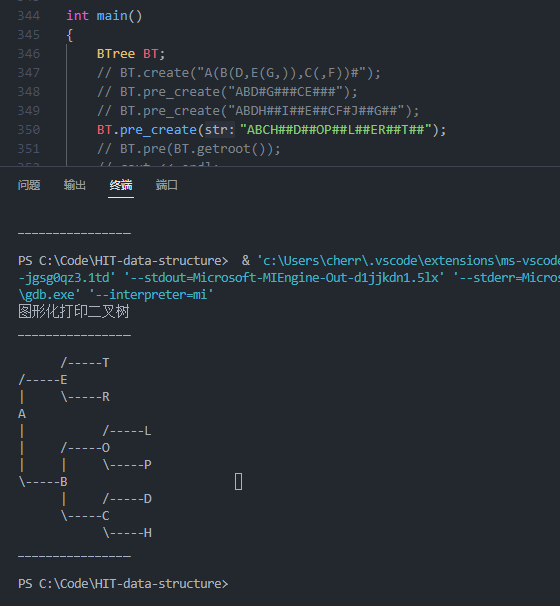
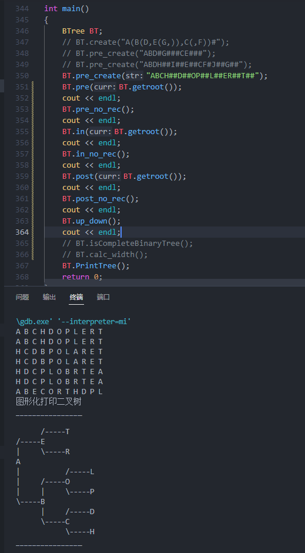
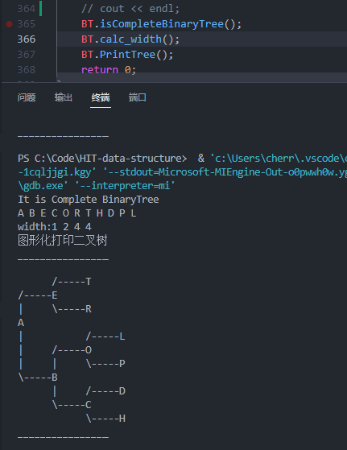

# 作业 2  树形结构及其应用 
   
作业题目：二叉树存储结构的建立、遍历和应用  

树和二叉树遍历是树形结构的最基础、最重要的核心算法。本作业要求掌握和巩固二叉树的存储结构的建立方法、二叉树的遍历方法、过程及应用。 

作业要求： 

1．编写建立二叉树的动态（或者静态）二叉链表存储结构（左右链表示）的程
序，并以适当的形式显示和保存二叉树； 

2．采用二叉树的上述二叉链表存储结构，编写程序实现二叉树的先序、中序和
后序遍历的递归和非递归算法以及层序遍历算法，并以适当的形式显示和保
存二叉树及其相应的遍历序列； 

3．设计并实现判断任意一棵二叉树是否为完全二叉树的算法。 
  
4．设计并实现计算任意一棵二叉树的宽度的（递归或非递归）算法。

   
